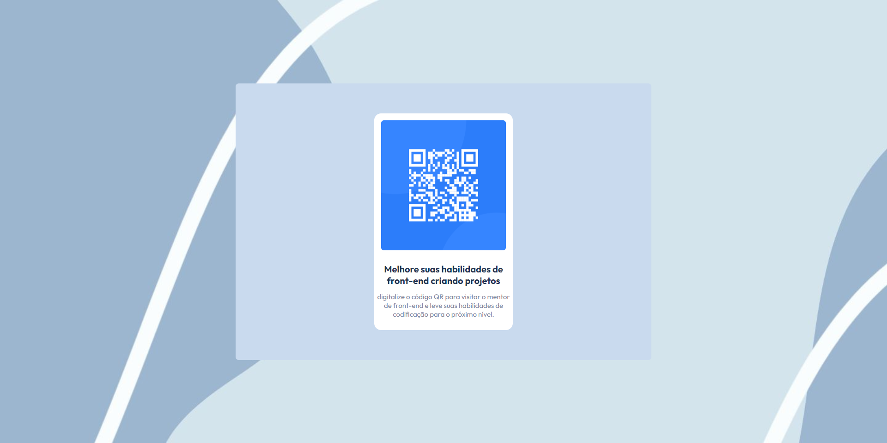

# QR-Code-component
Desafio componente QR [(Frontend Mentor)](https://www.frontendmentor.io/challenges/qr-code-component-iux_sIO_H).

# Ferramentas utilizadasa
 * Nesse desafio utilizei apenas HTML5 e CSS3.

# Você pode ver o meu resultado acessando a baixo.

* [Acessar o desafio](https://davi-alohadev.github.io/QR-Code-component/)

